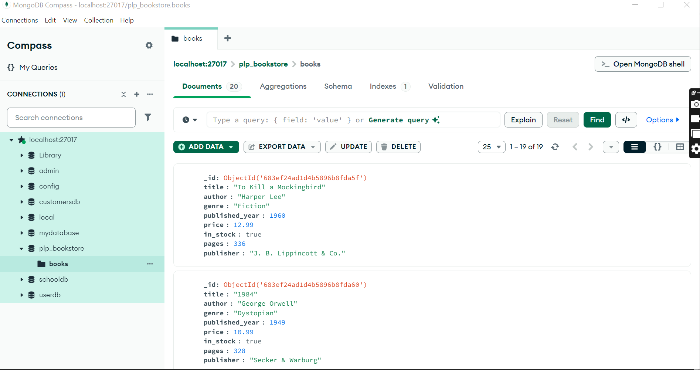

---

# 📚 MongoDB Fundamentals Assignment

## 📖 Overview

This project demonstrates foundational and advanced MongoDB skills, including database setup, CRUD operations, aggregation pipelines, and indexing. It uses a collection of book documents to simulate a real-world bookstore database.

---

## 📁 Project Structure

- `insert_books.js`  
  Node.js script that connects to MongoDB and inserts 20 sample book documents into the `plp_bookstore` database, `books` collection. The script safely drops the existing collection before inserting new data.

- `queries.js`  
  Contains MongoDB queries demonstrating:  
  - Basic CRUD operations (find, update, delete)  
  - Advanced filtering with projection, sorting, and pagination  
  - Aggregation pipelines for data grouping and analysis  
  - Index creation and query performance analysis

- `README.md`  
  This file — provides setup instructions, script usage, and testing guidance.

- `screenshot.png` (or similar)  
  A visual screenshot from MongoDB Compass or Atlas showing your database, collections, and sample documents.

---

## 🖼️ Screenshot

Below is a snapshot of the `books` collection in MongoDB Compass showing sample data:



- **MongoDB** installed and running locally, or an active MongoDB Atlas cluster  
- **Node.js** installed (v16.x or higher recommended)  
- Basic familiarity with Git and command-line tools

---

## 🚀 Setup Instructions

1. **Clone your GitHub Classroom repository:**

   ```
   git clone https://github.com/your-username/your-assignment-repo.git
   cd your-assignment-repo
   ```

2. **Install dependencies (if applicable):**

   ```
   npm install
   ```

3. **Configure MongoDB connection (if needed):**

   - By default, the script connects to: `mongodb://localhost:27017`  
   - To use MongoDB Atlas, replace the `uri` variable in `insert_books.js` with your connection string.

---

## 📥 Running the Insert Script

To populate your MongoDB collection with sample book data:

```
node insert_books.js
```

- The script drops the existing `books` collection (if any) and inserts 20 new documents.  
- Console output will confirm successful insertion.

---

## 🔍 Running Queries

`queries.js` contains MongoDB shell commands. These are **not runnable** via Node.js directly.

### Option 1: Use MongoDB Shell (`mongosh`)

1. Start the shell:

   ```
   mongosh
   ```

2. Switch to the database:

   ```
   use plp_bookstore
   ```

3. Copy-paste queries from `queries.js` into the shell.

---

### Option 2: Use MongoDB Compass

- Connect to your database using Compass.  
- Use the **Find** tab for standard queries or the **Aggregations** tab for pipeline-based queries.  
- Paste queries from `queries.js` and view the results interactively.

---

### Option 3: Run Scripts from Shell

You can run scripts directly using:

```
mongosh plp_bookstore --file queries.js
```

Or, inside `mongosh`, load the script with:

```
load('queries.js')
```

---

## ⚡ Indexing and Performance

- `queries.js` includes index creation:  
  - Single-field index on `title`  
  - Compound index on `author` and `published_year`  
- Use `.explain("executionStats")` on your queries to analyze performance improvements.

---

## 📌 Notes

- Ensure MongoDB server is running before executing any scripts.  
- Update connection string in `insert_books.js` if using Atlas.  
- Optionally, you can add a custom script in `package.json`:

  ```
  "scripts": {
    "insert-books": "node insert_books.js"
  }
  ```

  Then run it with:

  ```
  npm run insert-books
  ```

---

## 📚 References

- [MongoDB Shell Scripting](https://www.mongodb.com/docs/mongodb-shell/write-scripts/)  
- [Running MongoDB Commands in Shell](https://www.w3resource.com/mongodb/snippets/how-to-execute-mongodb-commands-through-shell-scripts.php)  
- [MongoDB Node.js Driver Guide](https://www.mongodb.com/docs/drivers/node/current/quick-start/)

---

*Prepared by Tedy Ouma*  
*Date: June 3, 2025*

---


